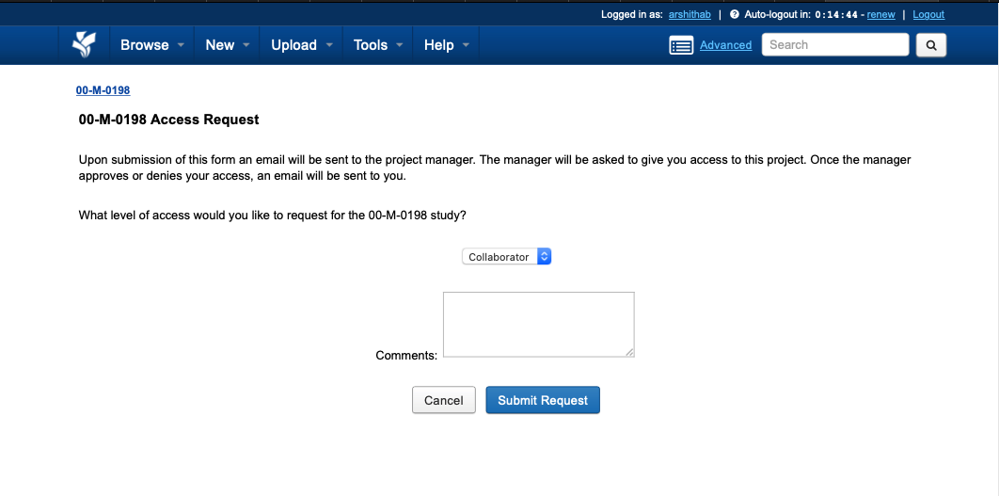
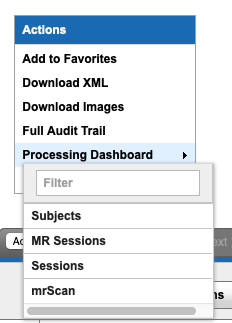

# Using XNATpy to download data from FMRIF XNAT server

## Overview

This is short tutorial to download data from the FMRIF XNAT server using the XNATpy wrapper built on XNAT API. There are many other wrappers out there (e.g., [DataLad XNAT](http://docs.datalad.org/projects/datalad-xnat/en/stable/index.html)) that you could use but this is just the one that I have most experience with. This document is also meant to filter down XNATpy documentation to just few commands that can be used to query [XNAT FMRIF](https://fmrif-xnat.nimh.nih.gov/) server and download desired subject data.


## Background

The functional MRI Facility (FMRIF) at NIH moved from [FMRIF DICOM Archive](https://gold.nimh.nih.gov)
to [XNAT FMRIF](https://fmrif-xnat.nimh.nih.gov/), an open
source imaging informatics platform developed by the Neuroinformatics Research Group at Washington University. XNAT's core functions are to manage importing, archiving, processing and securely distributing imaging and related study data. Being able to download data via the API has made DSST's data preparation pipeline A LOT more reproducible.


## Access

NIH users can access the FMRIF XNAT database through the API or the web interface. If this is your first time playing around with XNAT, I'd recommend starting with the web interface to see the project organization and also, to request access to projects. However, to download the DICOM data I'll be using the [XNATpy API](https://xnat.readthedocs.io/en/latest/#).

1. Go to XNAT's institutional login page at https://fmrif-xnat.nimh.nih.gov/ and log in using NIH credentials. 
2. On the home page, you'll see a list of projects. To request access to a project, search for it by project ID. For example, for the NIMH Healthy Volunteers protocol has the project ID "17-M-0181" which is also the protocol number. 




## Compile subjects list to be downloaded

This is an example of downloading all subjects' MRI data available in a project. You can filter the list according to your requirements while querying through the API or the web interface. 

1. Once you've been granted access to the project, from the `Actions` sidebar -> select `Processing Dashboard` -> click on `Subjects`.

    

2. This will take you to page that displays two columns, `Project` and `Subject` with a few processing options on the header bar. To download the DICOMS, all you need are the `Subject` column with the participants' MRNs. (Unfortunately, sometimes the participant name.)

    

3. Now, click on the `Download CSV` button to save it on your local machine. 
4. If you don't wanted to download all subjects' data then filter down the list downloaded in previous step  to only the  the list downloaded in previous step to 


## Download DICOM data via XNATpy API

1. Before downloading data for the first time, you'll need to setup the following:
   1. A credentials file with NIH username and password for authentication. For example, my credentials are stored at `~/.xnat` in YAML format as follows:
         ```bash
           username: myusername
           password: mytopsecret
        ```

      **NOTE: Please change the permissions of your credentials file so only YOU can access it. The command to change permission would be `chmod 600 ~/.xnat`. I'm still looking for options that do not require password to be stored in plaintext but if you know how to do this with xnat, please let me know!** 
   
   2. The python package XNATpy which can be installed in your python virtual environment by:
      ```bash
      pip install xnat
      ```
      If you run into issues, check out https://xnat.readthedocs.io/en/latest/#
   
   2. I've written a helper script to start downloading data from FMRIF XNAT server. You can find it [here](https://xnat.readthedocs.io/en/latest/#). To run it successfully, you'll have to provide the following:
      1. Path to credentials file
      2. Project ID on XNAT
      3. List of MRNs to be downloaded
      4. Output directory to download the DICOMs to 
   
       Example:
       ```bash
        python xnat_data_download.py \
        ~/.xnat \
        17-M-0181 \
        /path/to/mrns/list \
        -o /path/to/xnat/downloads
       ```


## Helpful Links

1. FMRIF XNAT server - https://fmrif-xnat.nimh.nih.gov/
2. XNATpy documentation - https://xnat.readthedocs.io/en/latest/#
