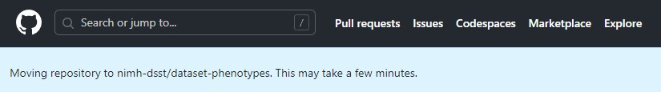

# GitHub Ownership Transfer

This is a quick guide on transferring ownership of a GitHub repository. For this tutorial, we will be using the [`ericearl/dataset-phenotypes` repository](https://github.com/ericearl/dataset-phenotypes) and transferring ownership over to the [`nimh-dsst` GitHub organization](https://github.com/nimh-dsst). By the end of reading this, you should know the appropriate steps to take to transfer ownership of a repository and continue to maintain the repository.

## Step 1: Go to the existing repository you want to transfer ownership

Go to the existing repository on GitHub from which you'd like to transfer ownership somewhere else.


## Step 2: Go to the Danger Zone

Click on the **Settings** tab. This will take you to the repository's General settings page. Way down at the bottom of the page, you will see a **Danger Zone** section.


## Step 3: Go to the transfer repository page

Under the **Transfer ownership** section click on the **Transfer** button. This will pop up a **Transfer repository** page.


## Step 4: Confirm you're ready to transfer ownership

Under the **New owner** section you can use the **Select one of my organizations** radio button's drop-down option to select the organization to which you'd like to transfer the repository. Then type into the bottom text box the current owner and name of the repository as it instructs right there to confirm you're ready to transfer ownership.


## Step 5: Confirm your access

Click the **I understand, transfer this repository.** button. A **Confirm access** modal dialog will appear where you have to confirm it's you somehow. I use Google Authenticator which is why the below screenshot shows that. This will transfer the repository to the organization you selected.


## Step 6: Small notice

After confirming access, GitHub will take you back to your homepage and notify you about the time it might take to migrate things.



## Step 7: Update any local repositories

Inform your contributors to update their git remote URLs to the new repository to avoid confusion.

```shell
git remote set-url origin NEW_URL
```

For instance, the `NEW_URL` for the example in this tutorial is `git@github.com:nimh-dsst/dataset-phenotypes.git` so the command I used was:

```shell
git remote set-url origin git@github.com:nimh-dsst/dataset-phenotypes.git
```

## End

That's it! Good luck not missing any typing or clicking. If you still want to read more about this, you can read GitHub's official guide here: [Transferring a repository](https://docs.github.com/en/repositories/creating-and-managing-repositories/transferring-a-repository).
